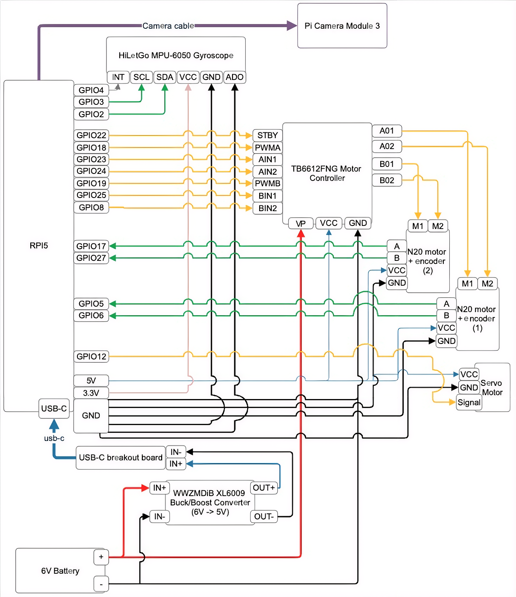

# Whiteboard Eraser

An autonomous whiteboard eraser robot built on a Raspberry Pi 5. Uses computer vision to detect markings on a whiteboard and navigates to erase them. Initially conceived as a handy and cool tool for our math teacher Mr. Perna, Mark is ready to vroom across surfaces and unmark any unwanted marks.




## Project Structure

```
whiteboard-eraser/
├── lib/                    # Hardware abstraction layer
│   ├── motor.py            # N20 motor control with encoders
│   ├── servo.py            # Steering servo control
│   └── gyro.py             # MPU-6050 gyroscope/IMU
├── src/                    # Algorithm and application code
│   ├── whiteboard_eraser_main.py   # Main control loop
│   ├── car_controller.py           # PID control for motion
│   ├── simple_marking_detector.py  # Computer vision detection
│   ├── localization.py             # Position tracking (odometry + gyro)
│   ├── mapping.py                  # Global marking map
│   ├── pathfinder.py               # A* pathfinding
│   └── ...
├── setup/                  # Installation scripts
│   ├── setup_service.sh    # Systemd service installer
│   └── install_dependencies.sh
└── ...
```

### lib/ - Hardware Abstraction

Low-level drivers that interface directly with hardware components. These modules abstract away GPIO pins, I2C communication, and PWM signals into clean Python APIs.

### src/ - Algorithms

High-level application code including computer vision, path planning, localization, and the main state machine. These modules use the hardware abstractions from `lib/` to control the robot.

## Bill of Materials

| Category | Component | Qty | Specifications | Price | Notes |
|----------|-----------|-----|----------------|-------|-------|
| Main Controller | [Raspberry Pi 5 Model B](https://www.microcenter.com/product/673711/5;_ARM_Cortex_A76_Quad_Core_Processor;_8GB_LPDDR4X_RAM) | 1 | 8GB RAM | $95 | Official store or authorized retailers like Adafruit, CanaKit |
| Camera | [Raspberry Pi Camera Module 3](https://www.microcenter.com/product/662016/Camera_3) | 1 | Wide preferred | $35 | Standard version or wide angle |
| Connectivity | [Camera Cable](https://www.pishop.us/product/camera-cable-for-raspberry-pi-5/) | 1 | 15cm-30cm ribbon cable | $4 | Required for Camera Module 3 connection |
| Motors | [N20 DC Gear Motor with Hall Encoder](https://a.co/d/9TnXhcp) | 8 | 6V, All-metal Gearbox, 60RPM | $22 ea | Small but powerful. Main driving force of the bot |
| Motors | [N20 DC Gear Motor w/o Encoder](https://a.co/d/ak1BJBg) | 4 | 6V, All-metal Gearbox, 60RPM | $18 ea | No encoder needed for the front wheels |
| Motor Driver | [TB6612FNG Motor Driver Board](https://www.sparkfun.com/sparkfun-motor-driver-dual-tb6612fng-1a.html) | 1 | Dual H-Bridge 1.2A per channel | $15 | |
| Steering | [Miuzei MG90S Micro Servo](https://a.co/d/aozp7PX) | 1 | 9g Metal Geared Servo Motor | $14 | 4-pack available, only need 1 for steering mechanism |
| IMU | [MPU-6050](https://a.co/d/8KAH4Vv) | 1 | 6-axis Gyroscope + Accelerometer I2C | $7 | GY-521 breakout board |
| Power | [Blomiky 6V NiMH Battery](https://a.co/d/0zdu3bS) | 1 | 2400mAh AA NiMH with SM-2P plug | $15 | RC car rechargeable battery |
| Power | [XL6009 Buck/Boost Converter](https://a.co/d/98DkTq4) | 1 | DC-DC 3.8-32V to 1.25-35V | $10 | 3-pack, adjust output to 5V for Pi5 |
| Connectivity | [MicroSD Card](https://a.co/d/3vxdAz5) | 2 | 64GB+ Class 10 U1 | $26 | For Raspberry Pi OS |
| Connectivity | [Jumper Wires](https://a.co/d/bcNZuKm) | 1 set | M-F, M-M, F-F | $10 | Dupont connector wires |
| Mechanical | [PLA Filament](https://us.store.bambulab.com/products/pla-basic-filament) | 1kg | 1.75mm PLA | $20 | For prototyping chassis |
| Mechanical | [PET-CF Filament](https://us.store.bambulab.com/products/pet-cf) | .5kg | 1.75mm Carbon Fiber PETG | $45 | For final chassis, structural parts and wheels |
| Mechanical | [Tires](https://www.injora.com/products/4pcs-1-9-108-40mm-rubber-tyre-wheel-tires-for-1-10-rc-rock-crawler) | 4 | INJORA 1.9" 108x40mm Rubber | $20 | High performance rock crawler tires |
| Optional | [Raspberry Pi 5 Active Cooler](https://www.adafruit.com/product/5815) | 1 | For RPi5 | $14 | For steady temp despite heavy CV algorithms |
| Magnets | [30x3mm Neodymium Magnets](https://a.co/d/8jqn8wP) | 1 set | 10 pieces | $13 | For attaching front wheels to magnetic whiteboard |
| Magnets | [2in Fishing Magnet](https://a.co/d/bWNcJSW) | 1 | Strong with hook | $10 | Main attraction force to keep car on board |

## Getting Started

See [USAGE.md](USAGE.md) for installation and usage instructions.

